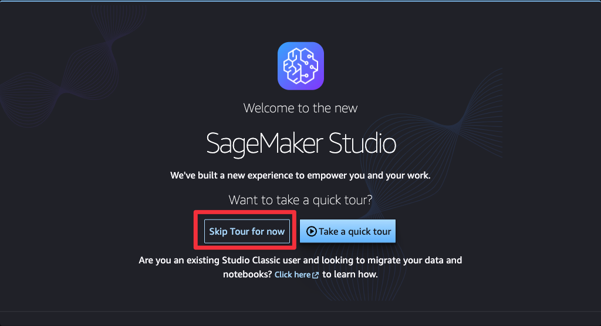

# DevelopersIO 2024 Amazon Bedrock のハンズオン

ハンズオンへご参加いただきありがとうございます！

このセッションでは Knowledge bases for Amazon Bedrock を利用して、ベクトル検索型の RAG システムを体験してみます。

本セッションのレベルは 200 から 300 を想定して作成しています。

レベルの説明

- Level 100 : AWS サービスの概要を解説するレベル
- Level 200 : トピックの入門知識を持っていることを前提に、ベストプラクティス、サービス機能を解説するレベル
- Level 300 : 対象のトピックの詳細を解説するレベル
- Level 400 : 複数のサービス、アーキテクチャによる実装でテクノロジーがどのように機能するかを解説するレベル

## ラボ環境へのログイン

ハンズオン用に払い出された AWS アカウントの認証情報を利用し AWS へログインします。

> ご自身のアカウントで試してみたい方は [IaC](./terraform/lab/README.md) を利用し、ラボ環境を再現できます。

画面上部から `SageMaker` と入力し、 Amazon SageMaker をクリックします。

SageMaker コンソールに移動しドメイン、 `devio-2024` をクリックします。

`ユーザープロファイル`から `devio-2024-user` の起動をクリック、パーソナルアプリケーションの `Studio` を選択します。（別タブに移動します。）

ツアーはスキップします。

Code Editor をクリックします。

Name が `devio-2024-space` のスペースを起動します。

Status が `Running` になったら、 Actions から `Open` をクリックします。（別タブに移動します。）

Code Editor が起動したら、ラボ環境の立ち上げに成功です！

Next: [環境のデプロイ](./handson/01.md)
