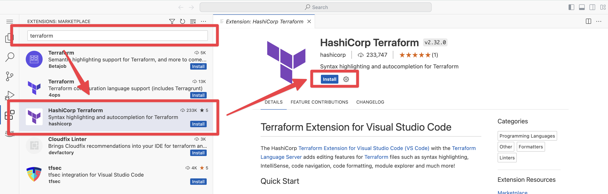
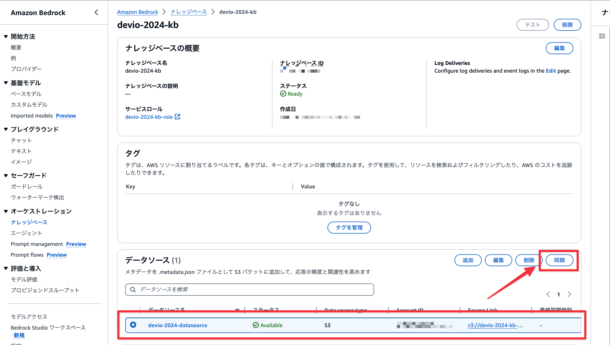

# 環境のデプロイ

このハンズオンでは、 HashiCorp Terraform で AWS インフラのデプロイ、 Jupyter Notebook で RAG の動作確認を行います。まずはインフラ環境のデプロイを行います。

今回は以下の構成で RAG システムを構築し、 Knowlege bases for Amazon Bedrock で提供されている機能にフォーカスしていきます。

WIP

ハンズオンのアジェンダは以下のとおりです。

- Retrieve と RetrieveAndGenerate の違い
  - Retrieve して Generate してみよう
- ハイブリッド検索について体験してみよう
  - 日本語プラグインを利用してみよう
- メタデータフィルタリングについて体験してみよう
  - 属性地に基づいてコンテンツの出し分けをしてみよう
- Bedrock のログを有効化してみよう
- クエリを分割してみよう

## HashiCorp Terraform のインストール

作業環境には HashiCorp Terraform がインストールされていないため、インストール作業を行います。

画面左上の項目をクリックし、ターミナルを起動します。


以下のコマンドで HashiCorp Terraform をインストールします。

```bash
sudo apt-get update && sudo apt-get install -y gnupg software-properties-common
wget -O- https://apt.releases.hashicorp.com/gpg | \
gpg --dearmor | \
sudo tee /usr/share/keyrings/hashicorp-archive-keyring.gpg > /dev/null
gpg --no-default-keyring \
--keyring /usr/share/keyrings/hashicorp-archive-keyring.gpg \
--fingerprint
echo "deb [signed-by=/usr/share/keyrings/hashicorp-archive-keyring.gpg] \
https://apt.releases.hashicorp.com $(lsb_release -cs) main" | \
sudo tee /etc/apt/sources.list.d/hashicorp.list
sudo apt update
sudo apt-get install terraform
```

[Install Terraform](https://developer.hashicorp.com/terraform/tutorials/aws-get-started/install-cli)

以下のコマンドで HashiCorp Terraform のバージョンを確認します。

```bash
terraform -v
```

## 資材のダウンロード

以下のコマンドでハンズオン資材となるソースをダウンロードします。

```bash
git clone https://github.com/takakuni-classmethod/DevelopersIO-2024-bedrock.git
ls
```

## インフラのデプロイ

HashiCorp Terraform を利用してインフラのデプロイを行います。

```bash
cd /home/sagemaker-user/DevelopersIO-2024-bedrock/terraform/rag

terraform init
terraform apply --auto-approve
```

5 分から 15 分程度のデプロイを想定しています。

以下のようにストレージ設定で Knowledge bases for Amazon Bedrock の作成に失敗した場合、 再度 `terraform apply --auto-approve` を実行してください。

```bash
WIP
```

## 拡張機能のインストール（デプロイ待機中）

デプロイを待っている間に HashiCorp Terraform の拡張機能をインストールします。（後ほどのハンズオンで利用します）



## デプロイ終了後

### ナレッジベース ID を控える

Bedrock コンソールから`ナレッジベース`、 `devio-2024-kb` をクリックします。ナレッジベース ID を後ほど利用するためメモしておいてください.


### データソースの同期

データのエンべディング及びナレッジベースへのインデックス登録を行います。Bedrock コンソールから`ナレッジベース`、 `devio-2024-kb` をクリックします。データソースから `devio-2024-datasource` を選択し、`同期`を行います。



同期が完了すればセットアップ完了です。

Next: [Retrieve と RetrieveAndGenerate の違い](./02.ipynb)
