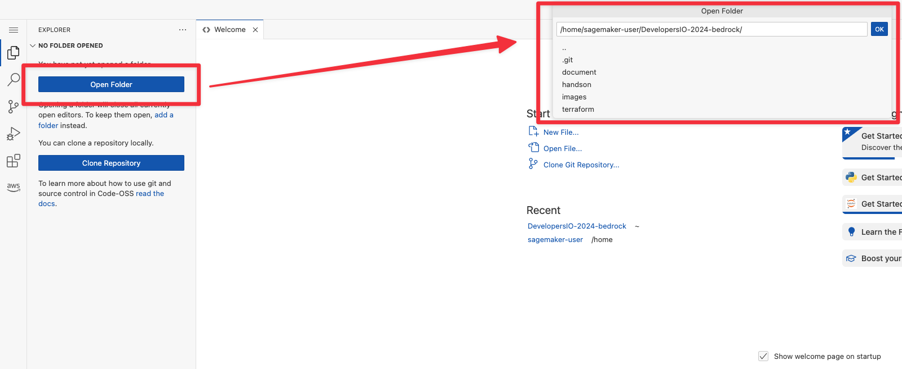

# 環境のデプロイ

このハンズオンでは、 HashiCorp Terraform で AWS インフラのデプロイ、 Jupyter Notebook で RAG の動作確認を行います。まずはインフラ環境のデプロイを行います。

今回は以下の構成で RAG システムを構築し、 Knowlege bases for Amazon Bedrock で提供されている機能にフォーカスしていきます。


ハンズオンのアジェンダは以下のとおりです。

- Retrieve と RetrieveAndGenerate の違い
  - Retrieve して Generate してみよう
- ハイブリッド検索について体験してみよう
  - 日本語プラグインを利用してみよう
- メタデータフィルタリングについて体験してみよう
  - 属性値に基づいてコンテンツの出し分けをしてみよう
- Bedrock のログを有効化してみよう
- クエリを分割してみよう

## HashiCorp Terraform のインストール

作業環境には HashiCorp Terraform がインストールされていないため、インストール作業を行います。

画面左上の項目をクリックし、ターミナルを起動します。


以下のコマンドで HashiCorp Terraform をインストールします。

```bash
sudo apt-get update && sudo apt-get install -y gnupg software-properties-common
wget -O- https://apt.releases.hashicorp.com/gpg | \
gpg --dearmor | \
sudo tee /usr/share/keyrings/hashicorp-archive-keyring.gpg > /dev/null
gpg --no-default-keyring \
--keyring /usr/share/keyrings/hashicorp-archive-keyring.gpg \
--fingerprint
echo "deb [signed-by=/usr/share/keyrings/hashicorp-archive-keyring.gpg] \
https://apt.releases.hashicorp.com $(lsb_release -cs) main" | \
sudo tee /etc/apt/sources.list.d/hashicorp.list
sudo apt update
sudo apt-get install terraform
```

[Install Terraform](https://developer.hashicorp.com/terraform/tutorials/aws-get-started/install-cli)

以下のコマンドで HashiCorp Terraform のバージョンを確認します。

```bash
terraform -v
```

## 資材のダウンロード

以下のコマンドでハンズオン資材となるソースをダウンロードします。

```bash
git clone https://github.com/takakuni-classmethod/DevelopersIO-2024-bedrock.git
ls
```

## インフラのデプロイ

HashiCorp Terraform を利用してインフラのデプロイを行います。

```bash
cd ~/DevelopersIO-2024-bedrock/terraform/rag

terraform init
terraform apply --auto-approve
```

5 分から 15 分程度のデプロイを想定しています。

以下のように、ストレージ設定で Knowledge bases for Amazon Bedrock の作成に失敗した場合、 再度 `terraform apply --auto-approve` を実行してください。

```log
aws_bedrockagent_knowledge_base.this: Creating...
╷
│ Error: creating Bedrock Agent Knowledge Base
│
│   with aws_bedrockagent_knowledge_base.this,
│   on knowledgebase.tf line 113, in resource "aws_bedrockagent_knowledge_base" "this":
│  113: resource "aws_bedrockagent_knowledge_base" "this" {
│
│ operation error Bedrock Agent: CreateKnowledgeBase, https response error StatusCode: 400, RequestID: 46bd8a7c-b286-425d-a82f-ee9e4cc0eae1, ValidationException: The knowledge base storage configuration provided is invalid... Request failed: [security_exception] 403 Forbidden
```

## 拡張機能のインストール（デプロイ待機中）

デプロイを待っている間に HashiCorp Terraform の拡張機能をインストールします。（後ほどのハンズオンで利用します）

拡張機能タブから、 `terraform` と入力し、 HashiCorp Terraform をインストールします。


## デプロイ終了後

### ナレッジベース ID を控える

Bedrock コンソールから`ナレッジベース`、 `devio-2024-kb` をクリックします。ナレッジベース ID を後ほど利用するためメモしておいてください.


### データソースの同期

データのエンべディング及びナレッジベースへのインデックス登録を行います。Bedrock コンソールから`ナレッジベース`、 `devio-2024-kb` をクリックします。データソースから `devio-2024-datasource` を選択し、`同期`を行います。


同期が完了すればセットアップ完了です。

Next: [Retrieve と RetrieveAndGenerate の違い](./02.ipynb)

## フォルダを開く

`git clone` したディレクトリを開きます。 `Open Folder` から `/home/sagemaker-user/DevelopersIO-2024-bedrock/` を開きます。



### ターミナルを開く

再度、 Terraform 等を利用するため、ターミナルを開きます。画面左上の項目をクリックし、ターミナルを起動します。


### ターミナルが落ちてしまった時

07/19 時点で git の拡張機能の影響でターミナルが落ちてしまう現象が発生しています。

（OOM を気にしたのですがメモリ拡張しても事象の解決には至りませんでした...）

その場合はお手数ですが再度 SageMaker コンソールより再度、 Open から仮想環境を開き治してください。


#### それでも落ちる場合

それでも落ちる場合が、 07/19 時点で発生しています。

その場合は、 Stop をクリックしたのちに、再度 Run を実行してください。


ベースはコンテナベースで起動しているため、 Terraform を再度インストールする必要があります。

※ `git clone` した内容は EBS に保管しているため、コマンドの再実行は不要です。

```bash
sudo apt-get update && sudo apt-get install -y gnupg software-properties-common
wget -O- https://apt.releases.hashicorp.com/gpg | \
gpg --dearmor | \
sudo tee /usr/share/keyrings/hashicorp-archive-keyring.gpg > /dev/null
gpg --no-default-keyring \
--keyring /usr/share/keyrings/hashicorp-archive-keyring.gpg \
--fingerprint
echo "deb [signed-by=/usr/share/keyrings/hashicorp-archive-keyring.gpg] \
https://apt.releases.hashicorp.com $(lsb_release -cs) main" | \
sudo tee /etc/apt/sources.list.d/hashicorp.list
sudo apt update
sudo apt-get install terraform
```
